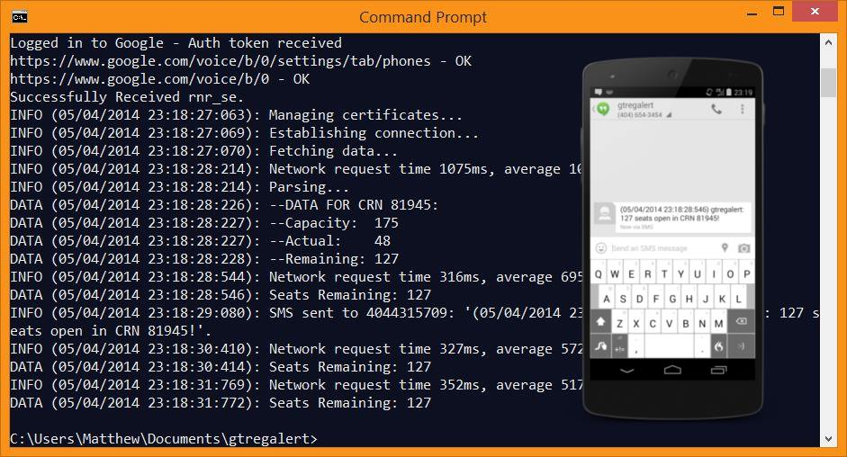

# gtregalert
_Georgia Tech Registration Alerts_

To use: compile and run
```
$ java gtregalert crn refreshInterval(ms) phoneNumber
```
Or run the included jar file:
```
$ java -jar gtregalert_fall14.jar crn refreshInterval(ms) phoneNumber
```

## Features
* Checks registration numbers for class at specified intervals
* Sends SMS to specified distination when a seat opens up
* Custom logging tool to display data or pipe to output file
* Can optionally write network data to CSV file for analysis by MATLAB script

## Sample Output
